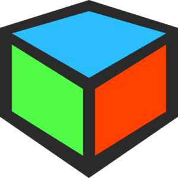

<html>
<div align="center">
  
</div>

<h1 align="center" style="font-family: 'Segoe UI',sans-serif">GeoPymetry</h1>

<p align="center">Welcome to GeoPymetry application. 
The main goal pursued by the author of this project was the ability to calculate all possible parameters of 
geometric figures, passing all known data to the input. You do not need to pre-select from a limited pool of calculation 
options, for example, calculating the parameters of a trapezoid only along two diagonals or sides. You can simply pass 
all the data you know to the program and receive the rest of the previously unknown parameters in response.
<br>At the moment, the application supports three languages: Ukrainian, Russian, English</p>
<br><br>
<div align="center">
    &nbsp;&nbsp;&nbsp;&nbsp;&nbsp;
    &nbsp;&nbsp;&nbsp;&nbsp;&nbsp;
    
</div>
<br>

<h2 style="font-family: 'Segoe UI',sans-serif">Installation</h2>

1. Clone git repository to your local machine
```shell
git clone <url>
```
2. Enter to project folder
```shell
cd GeoPymetry/
```
3. Check if [**Make**\*](#make-tip) installed.
```shell
make -version
```
   * Install it, if not `sudo apt install make`
   * If you can't install it, just replace commands by it equivalent from Makefile.
4. Install virtual environment & packages
```shell
make ve
```
* If you want to install development packages, run `pip install -r requirements-dev.txt`
5. Install `python3-tk` package
    * For Linux you can run
   ```shell
    make install_packages 
    ```
   * For other OS check this official Tkinter [documentation](http://tkdocs.com/tutorial/install.html)
6. Run application
```shell
make run
```

<h2>Configuration</h2>
All basic settings are stored in config file:

```jsonpath
config/base.py
```

Feel free to edit this file as you see fit.

```python
class Config:
    APP_TITLE = "GeoPymetry"
    APP_LANG = "en"
    FRAME_WIDTH = 1200
    FRAME_HEIGHT = 816
    FRAME_RESIZE_ABILITY = False
    LANGUAGES = (RU, EN, UA)
    ROOT_DIR = os.path.dirname(os.path.abspath("config"))
    STATIC_DIR = f"{ROOT_DIR}/static"
    BG_IMG = "base/bg.jpg"
    ICON_IMG = "base/icon.png"
    FLOAT_ROUNDING = 3
    CALC_DEPTH = 10
    
    ...
```
For example, you can select any available application language by changing the `APP_LANG` var.<br>
Be careful, changing some settings may affect the performance of the application!

<h2 style="font-family: 'Segoe UI',sans-serif">Usage</h2>

After you pass "welcome" page you'll be set to choose figure to process.<br><br>
<a href="https://ibb.co/tcNhFJ1"></a>

1. Tooltip panel, that shows a hint
2. Possible types of figures for processing
3. Current version of app

The next step is to choose the type of figure that is available. In fact, this is the same list of types as on the 
previous slide, only more visual.
<br><br>
<a href="https://ibb.co/7Wv3GTy"></a>
<br>
For example, we will use a right-angled triangle, and then we will try to calculate the parameters of my figure.
<br><br>
<a href="https://ibb.co/6Fpj7vJ"></a><br>

This is how the main interface looks like, in which we will work. Here there is an extended drawing of the selected 
figure, below we have a form for entering known data, and a button in the form of a calculator that will start 
processing the data.

Now let's try to enter known data.<br>

<a href="https://ibb.co/940r4FT"></a>

We have indicated that we know both cathetus of a right triangle. Please note that only numbers (int/float) can be 
entered in the field, and it is also forbidden to leave the field empty. If these rules are violated, the program will 
not process the data.

Our next step is to click on calculator button.<br>

<a href="https://ibb.co/PGbvfRP"></a>

Voila, and all the parameters of our figure are on the screen. Convenient, isn't it? :)

1. If you see this heading, everything went well!
2. If we want to reset the forms and continue working with the same shape, click the reset button.
3. If we want to choose a different figure or just return to the first stage, we press the home button.

Note that all calculations are saved until the refresh button is pressed.

You may run into a situation where, after processing the shape, you will still have "zeroed" forms.
<br><br>
<a href="https://ibb.co/NLWXPpv"></a>

This happens when the entered data is not enough to calculate all the parameters of the figure. The application 
tries to give the maximum number of possible parameters for calculation.

It is also possible that the data entered simply forms a non-existent figure.
<br><br>
<a href="https://imgbb.com/"></a>
<br>
Here, for example, we proposed to calculate the parameters of a trapezoid, which has three sides of 2 cm each, 
and the fourth is 100 cm. Of course, such a figure cannot physically exist.

<h2 style="font-family: 'Segoe UI',sans-serif">Tests</h2>

The project has a set of tests that ensures that the models produce the correct calculation of the parameters of the 
figures. If changes are made to the current functionality, you can start the test run with the command:

```shell
make tests
```

<h2 style="font-family: 'Segoe UI',sans-serif">Summing up</h2>
If using my application helped you in learning geometry, helped you pass some test, or just helped you find answers to your geometry questions, then I will consider that I have achieved the goal that I set for myself at the moment when I decided to do this project.
<br><br>Personally, with the help of this application, when it was still raw, I was preparing for the entrance exams to the university, by the way, I did well :) I checked my calculations on paper with those that GeoPymetry gave me on screen.
<br><br>I will try, if possible, to supplement the project with new functionality, add new figures, expand the scope of parameters possible for calculation, introduce new languages, and so on.
Any comments and pull requests are welcome, I'm open for dialogue.

<br><br><br><br>

<p align="right">Sincerely, the author of the project, <a href="https://github.com/AlexFoxalt">Alexfoxalt</a></p>
</html>
